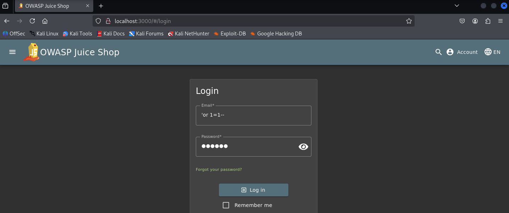
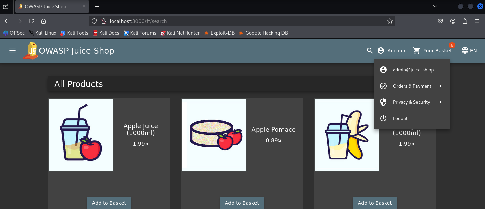

# SQL Injection - Login Bypass

## Vulnerability Description
The login form does not properly validate user input, allowing SQL injection attacks. An attacker can bypass authentication and gain unauthorized access to user accounts without knowing valid credentials.

## Solution
When logging on as email use:

```
' or 1=1--
```

Any password can be selected.

(Note: This is one possible solution. There are several ways to achieve the goal.)

## Key Takeaway
User input is directly concatenated into SQL queries without sanitization, allowing attackers to manipulate the query logic. The `or 1=1` always evaluates to true, bypassing authentication completely.

## Screenshots

### Malicious Payload


### Successful Login

