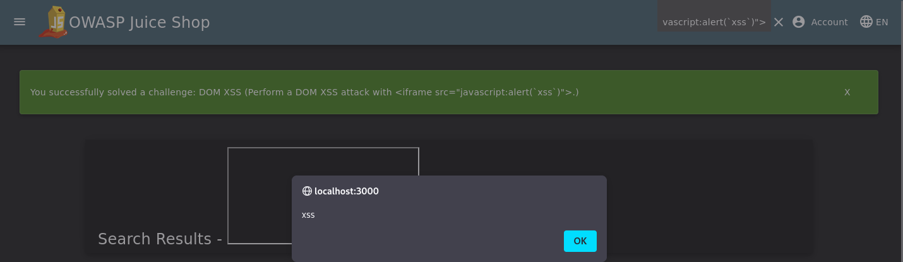

# Reflected XSS - Search Functionality

## Vulnerability Description
The search functionality does not properly sanitize user input, allowing reflected XSS attacks. An attacker can inject malicious JavaScript code that executes in the victim's browser when they click on a crafted link.

## Solution
In the search box, enter:

```html
<iframe src="javascript:alert(`xss`)">
```
Press Enter or click search button.

## Key Takeaway
User input from the search parameter is directly reflected in the page without proper encoding or sanitization. This allows attackers to inject arbitrary JavaScript code that executes in the context of the application.

### JavaScript Execution



