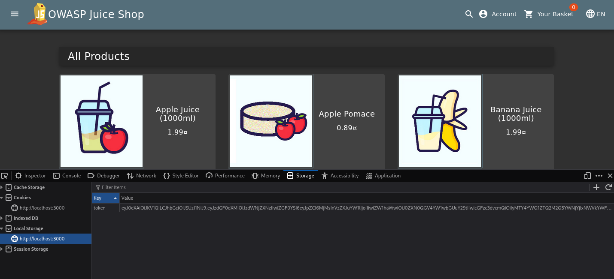
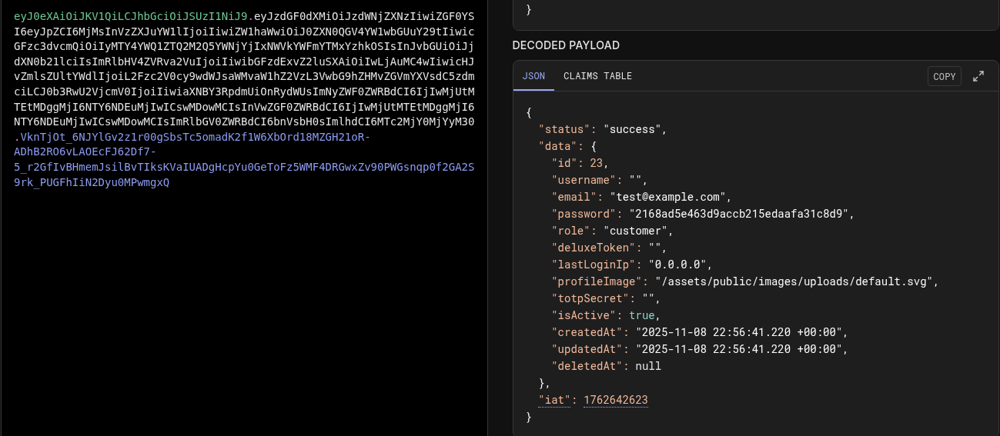
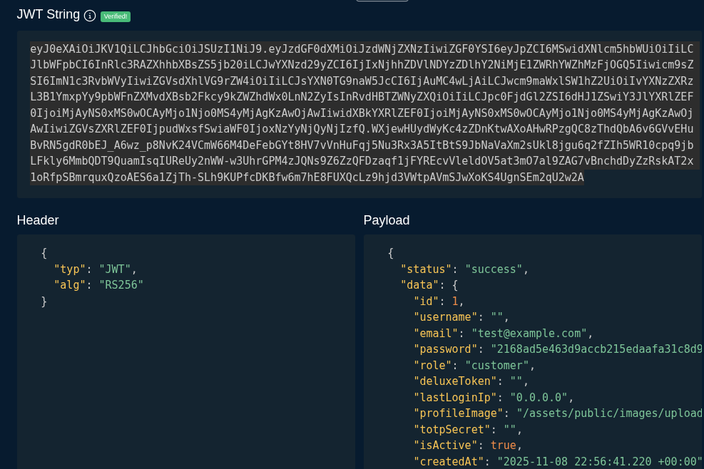
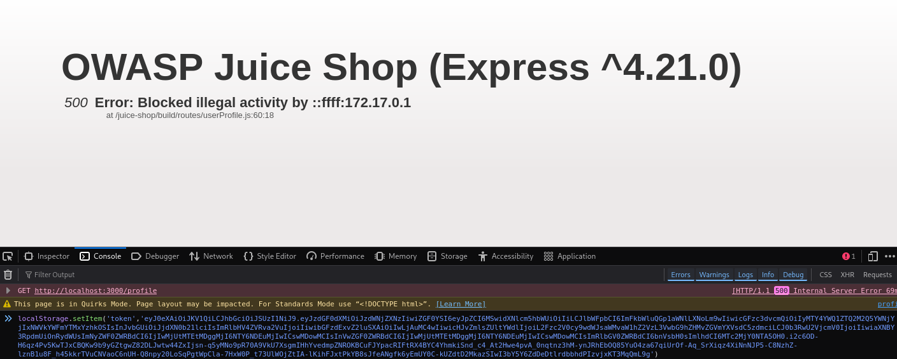

jwt-token-manipulation# JWT Token Manipulation - Privilege Escalation Attempt

## Vulnerability Description
The application uses JWT (JSON Web Token) for authentication. While the JWT structure allows for client-side modification, the application implements server-side validation that detects and blocks privilege escalation attempts. This demonstrates a defense-in-depth security approach.

## Solution
JWT token manipulation was attempted by:

1. Extracting the JWT token from browser's local storage
2. Decoding the token at https://jwt.io
3. Modifying the user ID from `23` to `1` (admin user)
4. Replacing the original token with the modified version

```javascript
// Console command used
localStorage.setItem('token', 'MODIFIED_JWT_TOKEN_HERE')
```

However, the application blocked this attempt with:
```
500 Error: Blocked illegal activity by ::ffff:172.17.0.1
```

(Note: This demonstrates that while token manipulation is technically possible, the application has proper server-side validation.)

## Key Takeaway
The JWT tokens can be decoded and modified on the client-side, but the application implements server-side validation that detects privilege escalation attempts. This shows proper implementation of authentication controls, where the server does not blindly trust client-provided tokens. The application validates claims and detects suspicious modifications.

## Screenshots

### Original JWT Token


### Token Decoded at jwt.io


### Modified Token (ID changed to 1)


### Blocked Request

