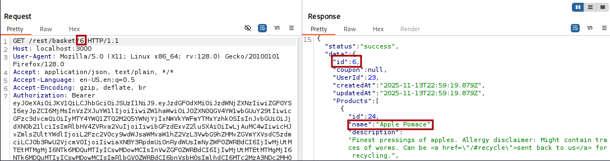
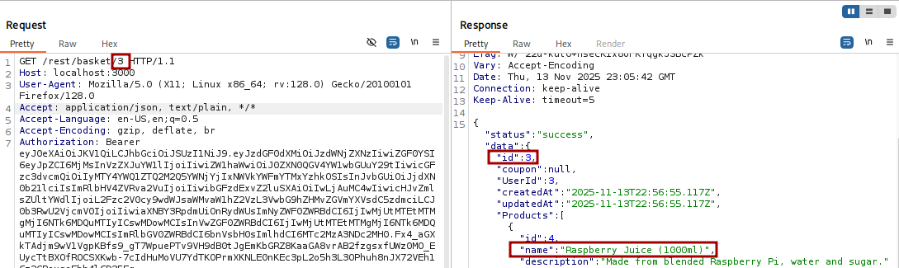

# IDOR - Insecure Basket Access

## Vulnerability Description
The basket API endpoint does not properly validate user authorization, allowing any authenticated user to access other users' shopping baskets by modifying the basket ID parameter. This is an Insecure Direct Object Reference (IDOR) vulnerability.

## Solution
Using Burp Suite Repeater, modify the basket ID in the API request:

```
GET /rest/basket/1 HTTP/1.1
```

Change the basket ID to access different users' baskets:

```
GET /rest/basket/1  → User 1's basket
GET /rest/basket/2  → User 2's basket
```

The API returns basket contents without validating if the requesting user owns that basket.

(Note: This vulnerability exists because the application only checks if a user is authenticated, not if they are authorized to access the specific basket.)

## Key Takeaway
The application fails to implement proper authorization checks on the basket endpoint. It only verifies that a valid JWT token exists but does not validate if the token's user ID matches the requested basket's owner. This allows horizontal privilege escalation where users can access resources belonging to other users at the same privilege level.

## Screenshots

### Own Basket Request


### Other User's Basket Request (Unauthorized Access)

